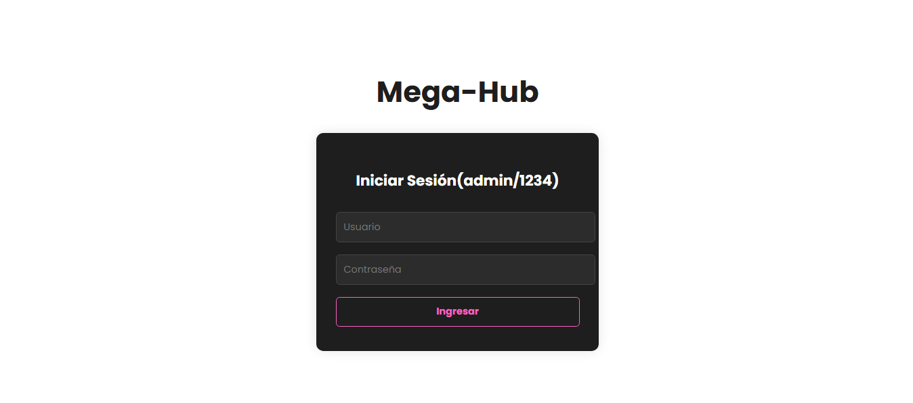
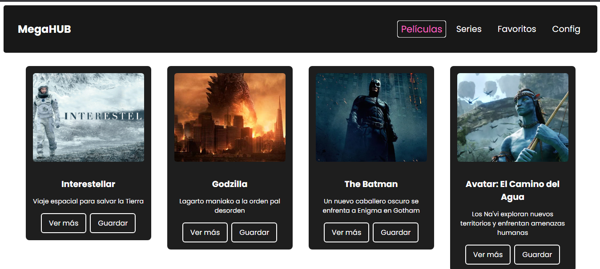
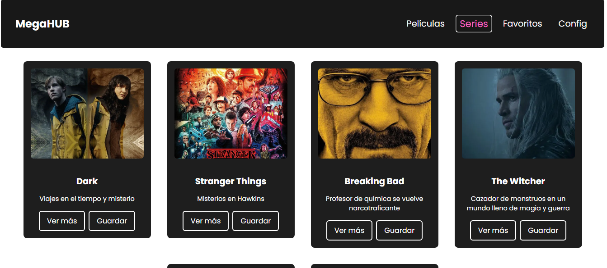
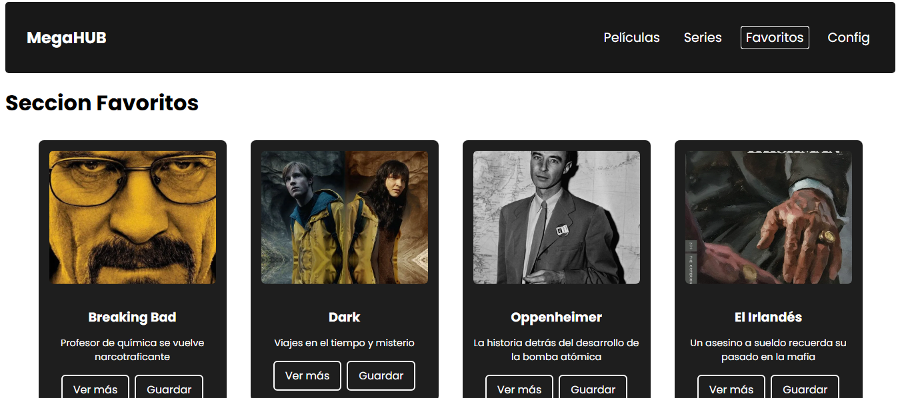
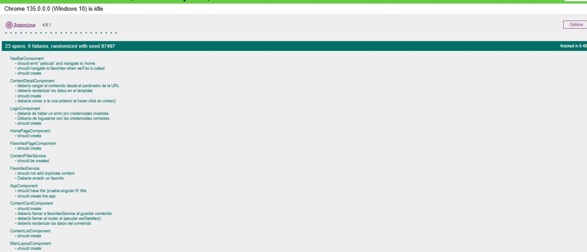
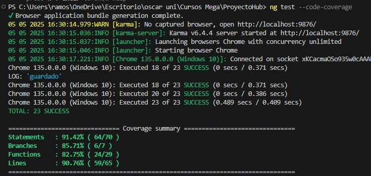
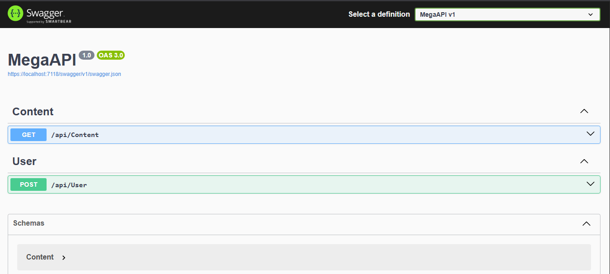

# 🎬 MegaHUB

Bienvenido a **MegaHUB**, el mejor proyecto de plataforma de entretenimiento 100% original (NO copia 😎). Pensada como una plataforma tipo streaming, donde podrás explorar contenido multimedia como **películas**, **series**, marcar favoritos y, próximamente, configurar tu perfil.

---

## 1. 📌 Título, descripción y objetivo

**MegaHUB** es una aplicación web construida con Angular 18 y una API en ASP.NET Core (.NET 8), conectada a una base de datos SQL Server. Su objetivo es ofrecer una plataforma tipo streaming con funcionalidades de login, visualización de contenido y una arquitectura pensada para escalar.

---

## 2. 👤 Nombre

Realizado por: [Oscar Emilio Ramos Reynaga]

---

## 3. 🧱 Mockup inicial


| Pantalla Principal | Vista Películas | Vista Series |
|--------------------|------------------|---------------|
|  |  |  |

| Detalle | Favoritos |
|---------|-----------|
|  |  |

---

## 4. 🖼️ Capturas del proyecto

| Pantalla Principal | Vista Películas | Vista Series |
|--------------------|------------------|---------------|
|  |  |  |

| Detalle | Favoritos |
|---------|-----------|
|  |  |

---

## 5. 📦 Instrucciones de instalación

### Frontend
```bash
git clone https://github.com/tu-usuario/megahub.git
cd MegaHub
npm install
ng serve
```

### Backend (.NET API)
```bash
cd backend/MegaHubApi
dotnet run
```
📝 Nota: Los scripts de creación de la base de datos se encuentran en src/app/data/query.txt.


## 6. 📚 Dependencias y librerías (.NET API)
- Microsoft.EntityFrameworkCore
- Microsoft.EntityFrameworkCore.SqlServer
- Microsoft.AspNetCore.Cors
- Microsoft.AspNetCore.Authentication.JwtBearer
- Swashbuckle.AspNetCore (Swagger)
- Pomelo.EntityFrameworkCore.MySql (opcional para MySQL)

## 7. 🔧 Descripción
Web API en ASP.NET Core que conecta con SQL Server usando Entity Framework Core. Estructura por capas:
- Controllers
- Services 
- Models

Features implementados:
- ✅ Login funcional
- ✅ Manejo de CORS
- ✅ Swagger para documentación
- ✅ Separación de responsabilidades
- ✅ Inyección de dependencias

Por ultimo mencionar que se hizo una conexion con el proyecto de Angular usando las librerias de HTTP de angular

## 8. 📈 Reporte de Code Coverage
### Pruebas


### Coverage


## 9. 🧠 Diagrama Entidad-Relación


## 10. 🔮 Posibles mejoras
- Implementar DTOs
- Añadir capa de repositorio
- Dockerizar (API + Frontend)
- Roles de usuario
- Sistema de favoritos persistente

## 11. 📘 Documentación API (Swagger)
Disponible en: `https://localhost:7118/swagger/index.html`

**Endpoints principales:**
### - Content
- `GET  /api/content`
---
### - User

- `POST /api/user`

## - Captura de pantalla


## 12. 🧪 Archivos de Configuración
```
en progreso
```

## ⚠️ Problemas Conocidos
- Docker no implementado
- Algunas rutas estáticas
- Validación de formularios pendiente

## 🔄 Retrospectiva
### ✅ Qué hice bien
- API funcional en ASP.NET Core
- Conexión estable con SQL Server
- Arquitectura por capas
- Inyección de dependencias
- Conexion de API con Angular
- Mejore las inconsistencias de Cards y Login

### ⚠️ ¿Qué no salio bien?
- Implementar repositorio
- Adoptar DTOs
- Dockerizar servicios
- Mejorar documentación de API y completar endpoints

### 🔁 ¿Que puedo hacer diferente?
- Empezar con Unit Testing
- Documentar arquitectura primero
- Usar contenedores desde inicio
- Considerar Clean Architecture

## 🔐 Credenciales de Prueba
- Usuario: admin
- Contraseña: 1234

## 🌐 Tecnologías
- Angular 18
- TypeScript  
- ASP.NET Core
- SQL Server / MySQL
- Swagger
- Entity Framework Core
