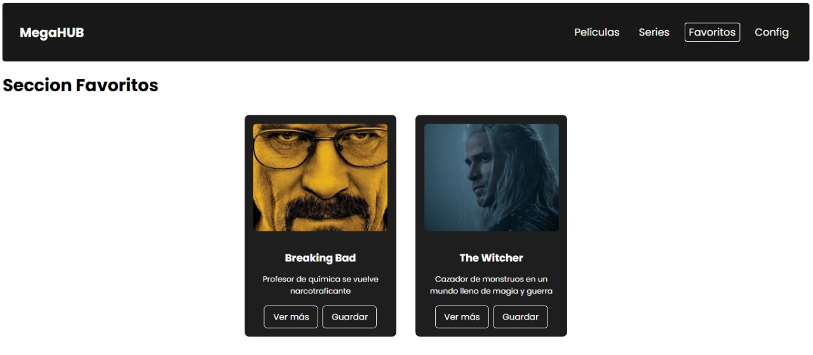

# 🎬 MegaHUB

Bienvenido a **MegaHUB**, el mejor proyecto de plataforma de entretenimiento 100% original (NO copia 😎). Pensada como una plataforma tipo streaming, donde podrás explorar contenido multimedia como **películas**, **series**, marcar favoritos y, próximamente, configurar tu perfil.

Durante el desarrollo se incorporan buenas prácticas (si todo sale bien 🙏), modularización del código, componentes reutilizables y arquitectura escalable en Angular 18.

---

## 🚀 Sprint 3 - Pruebas y Code Coverage (QA)

En este sprint se llevaron a cabo varias implementaciones: la creación de la vista de favoritos, diversos servicios, y cambios usando los nuevos control flows añadidos en la v17 (mejoras en performance). Además, se añadieron pruebas y se cumplió con un objetivo personal del 80% de code coverage.

## Pruebas


## Coverage


---

## 📝 Sprint Review

### 🎯 Objetivo del Sprint
- Implementación de funcionalidades asíncronas en el proyecto
- 50% de code coverage en testing
- Responsividad
- Performance
- RXJS
- Testing

### ✅ Alcance logrado
- +80% de code coverage general (Statements, Branches, etc.)
- RXJS (servicios y observables para manejar estados y favoritos)  
- Responsividad y mejor experiencia de usuario al cambiar el enfoque de la nav-bar
- Mejora de performance con el uso de los nuevos control flows (`@for`, `@if`), además de mayor claridad a la hora de leer código

### 🚧 Obstáculos encontrados
- No haber empezado con pruebas y desarrollo al mismo tiempo dificultó el seguimiento y cumplimiento de requerimientos con código de calidad  
- Algunos detalles visuales aún deben ajustarse (responsive y consistencia de tarjetas)

### 🔜 Próximos pasos
- Login con base de datos
- Implementación de la base de datos
- Mejorar diseño responsive y agregar animaciones  

---

## 🔍 ¿Qué vas a encontrar?

- 🟢 Login funcional con credenciales válidas (`admin` / `1234`)
- 🧭 Navegación fluida entre diferentes interfaces
- 🧩 Componentes reutilizables
- 🌐 Rutas dinámicas con parámetros
- 🧼 Y un código que *esperemos* no te sangre los ojos 😅

---

## 🧪 Cómo instalar y correr el proyecto

1. Clona el repositorio:
   ```bash
   git clone https://github.com/tu-usuario/megahub.git
   ```

2. Ingresa a la carpeta del proyecto:
   ```bash
   cd MegaHub
   ```

3. Instala las dependencias:
   ```bash
   npm install
   ```

4. Ejecuta el servidor de desarrollo:
   ```bash
   ng serve
   ```

---

## 🔐 Credenciales de acceso

- **Usuario:** `admin`  
- **Contraseña:** `1234`

---

## 🌍 Navegación y funcionalidades principales

- 🧭 Navegación entre secciones: Películas, Series, Favoritos, Configuración (pendiente)
- 🧩 Componentes standalone y reutilizables
- 📂 Rutas dinámicas con lazy loading (`/detalle/:titulo`)
- 💾 Visualización de contenido desde JSON local (simulando consumo de API)
- 🎯 Composición modular de vistas

---

## 📸 Mockups y vistas del proyecto

> A continuación, algunas capturas del proyecto en funcionamiento:

### 📱 Pantalla principal


### 🎞️ Vista de Películas


### 📄 Detalle de Contenido


### ⭐ Favoritos


---

## 📁 Contenido JSON simulado

Por ahora, el contenido de películas y series se carga desde un archivo `peliculas.json` ubicado en `src/assets/data/`.

Formato:
```json
{
  "titulo": "Un titulazo",
  "ruta_imagen": "una-increible-imagen.jpg",
  "descripcion": "Pedazo de descripción",
  "tipo": "pelicula"
}
```

---

## ✅ Cosas que hice bien

✔️ Entendí un problema en la arquitectura de la app: tener lógica compartida entre `home` y `nav-bar` creaba acoplamiento y dependencia que generaba conflictos en otras páginas

✔️ Comprendí el poder de los observables para compartir info/estados entre componentes de manera escalable y en tiempo real

✔️ Identifiqué cuándo es útil un observable y cuándo un simple service es suficiente (caso de: `nav-bar` y `favorites`)

✔️ Añadí más contenido y terminé algunas funcionalidades pendientes

---

## ⚠️ Cosas que podrían mejorar

❌ Algunos temas de CSS y diseño

❌ Una interfaz con más elementos; tal vez abusé un poco del minimalismo

❌ Los alias siguen pendientes :c

❌ Tal vez preparar mi login para una futura implementación con base de datos

---

## 🧠 Aprendizajes clave

- Diferencias entre comunicación con `@Input`, `@Output`, servicios y observables (para actualizaciones en tiempo real)
- Testing y code coverage (en funciones, branches, líneas, etc.)
- Nuevos control flows (`@for`, `@if`, `@else`, `@switch`) que mejoran performance y legibilidad, sin necesidad de templates extraños

---

## ⚙️ Tecnologías utilizadas

- Angular 18  
- TypeScript  
- HTML5 + SCSS  
- Node.js  
- JSON