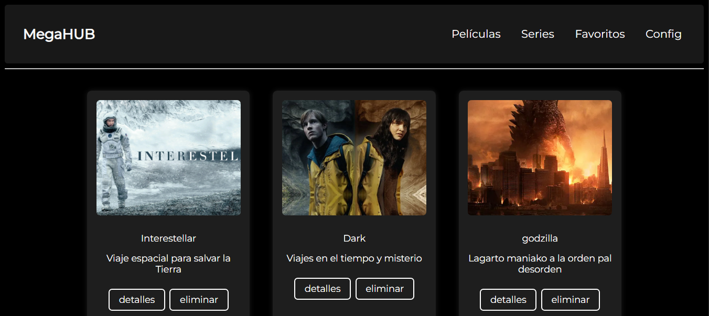

# MegaHUB
El mas mejor proyecto NO COPIA de plataformas de entretenimiento, en donde se desarolla una plataforma de streaming, estare llevando a cabo actualizaciones del mismo, algunas de las implementaciones seran funcionalidades relacionadas con **Películas**, **Series**, **Favoritos** y **Configuración**.

##  Lo que encontraras
- Un login genial
- Navegacion entre diferentes interfacces
- Si dios quiere, buenas practicas 
- Y un codigo que no te dara cancer de ojos(si dios quiere tambien)

## 📸 Vista del menu

## ⚙️ Tecnologías empleadas
- HTML

- CSS

- JavaScript

## 📁 Contenido JSON

El contenido extraido del json(por ahora solo peliculas) se compone de:
- `peliculas.json`: Contiene este formato : 
    {
      "titulo": "un titulazo",
      "ruta_imagen": "una increible imagen",
      "descripcion": "Pedazo de descripcion"
    } 
