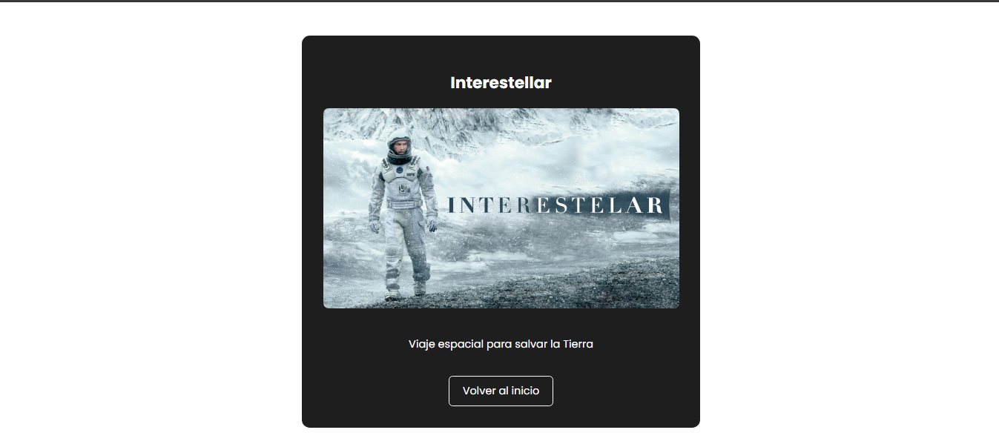

# 🎬 MegaHUB

Bienvenido a **MegaHUB**, el mejor proyecto de plataforma de entretenimiento 100% original (NO copia 😎).Pensada como una plataforma tipo streaming, donde podrás explorar contenido multimedia como **películas**, **series**, marcar favoritos y próximamente configurar tu perfil.

Durante el desarrollo se incorporan buenas prácticas (si todo sale bien 🙏), modularización del código, componentes reutilizables, y arquitectura escalable en Angular 18.

---

## 🚀 Sprint 2 - Angular Migration & Componentes

En este sprint se llevó a cabo la **migración total del proyecto a Angular 18**, además de la implementación de rutas dinámicas, componentes standalone, y modularización por funcionalidades.

---

## 🔍 ¿Qué vas a encontrar?

- 🟢 Login funcional con credenciales válidas (`admin` / `1234`)
- 🧭 Navegación fluida entre diferentes interfaces
- 🧩 Componentes reutilizables
- 🌐 Rutas dinámicas con parámetros
- 🧼 Y un código que *esperemos* no te sangre los ojos 😅

---

## 🧪 Cómo instalar y correr el proyecto

1. Clona el repositorio:
```
git clone https://github.com/tu-usuario/megahub.git
```
2. Ingresa a la carpeta del proyecto:
```
cd  ProyectoHub
```

3. Instala las dependencias:
```
npm install
```
4. Ejecuta el servidor de desarrollo:
```
ng serve
```
---

## 🔐 Credenciales de acceso

- **Usuario:** `admin`  
- **Contraseña:** `1234`

---

## 🌍 Navegación y funcionalidades principales

- 🧭 Navegación entre secciones: Películas, Series, Favoritos, Configuración
- 🧩 Componentes standalone y reutilizables
- 📂 Rutas dinámicas con lazy loading (`/detalle/:titulo`)
- 💾 Visualización de contenido desde JSON local (simulando consumo de API)
- 🎯 Composición modular de vistas

---

## 📸 Mockups y vistas del proyecto

> A continuación algunas capturas del proyecto en funcionamiento:

### 📱 Pantalla principal


### 🎞️ Vista de Películas


### 📄 Detalle de Contenido


### ⭐ Favoritos


---

## 📁 Contenido JSON simulado

Por ahora, el contenido de películas y series se carga desde un archivo `peliculas.json` ubicado en `src/assets/data/`.

Formato:
```
{
"titulo": "Un titulazo",
"ruta_imagen": "una-increible-imagen.jpg",
"descripcion": "Pedazo de descripción",
"tipo": "pelicula"
}
```

---

## ✅ Cosas que hice bien

✔️ Migración completa y correcta a Angular 18  
✔️ Uso de lazy loading en rutas principales  
✔️ Implementación de componentes reutilizables  
✔️ Estructura modular por funcionalidad  
✔️ JSON como fuente de datos simulada  
✔️ Diseño decente y coherente visualmente  
✔️ Buen aprendizaje de routing y módulos standalone  

---

## ⚠️ Cosas que podrían mejorar

❌ Al principio combiné módulos clásicos con standalone y me confundía un poco  
❌ Detalles en el diseño responsive  
❌ Tamaño inconsistente en los cards (a revisar)    

---

## 🧠 Aprendizajes clave

- Diferencias entre módulos tradicionales y standalone  
- Implementación de rutas dinámicas con parámetros  
- Cómo estructurar un proyecto Angular desde cero con buenas prácticas  
- Renderizado de contenido dinámico a partir de un archivo JSON  
- Comunicación entre componentes y diseño escalable  

---

## ⚙️ Tecnologías utilizadas

- Angular 18  
- TypeScript  
- HTML5 + SCSS  
- Node.js  
- JSON  

---

## 📝 Sprint Review

### 🎯 Objetivo del Sprint
Realizar la migración completa del proyecto a Angular 18, mejorar la arquitectura modular, crear vistas nuevas con navegación y cargar datos dinámicamente desde una fuente externa.

### ✅ Alcance logrado
- Migración exitosa a Angular 18  
- Nuevas rutas y módulos estructurados por funcionalidades  
- JSON funcionando como fuente de datos simulada  
- Mockups implementados en vistas funcionales  
- Interacción de detalle por título y login simulado

### 🚧 Obstáculos encontrados
- El uso combinado de módulos tradicionales y standalone generó algo de confusión  
- Algunos detalles visuales aún deben ajustarse (responsive y consistencia de tarjetas)  
- Falta de persistencia real (por ejemplo, en favoritos)  
- Tiempos justos para aplicar mejoras adicionales como tests o animaciones  

### 🔜 Próximos pasos
- Agregar backend (ASP.NET) 
- Implementar sistema de login real con JWT   
- Mejorar diseño responsive y agregar animaciones  