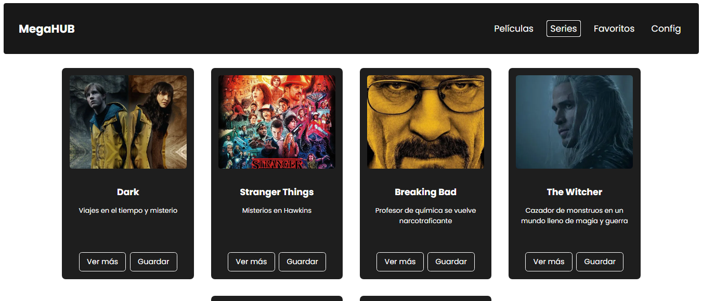
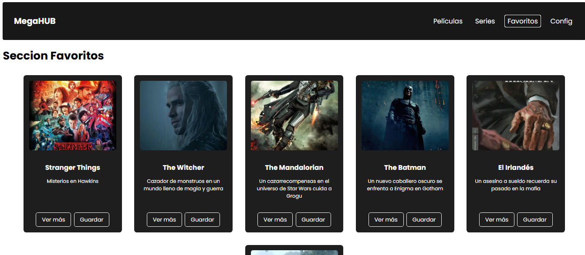

# 🎬 MegaHUB

Bienvenido a **MegaHUB**, el mejor proyecto de plataforma de entretenimiento 100% original (NO copia 😎). Pensada como una plataforma tipo streaming, donde podrás explorar contenido multimedia como **películas**, **series**, marcar favoritos y, próximamente, configurar tu perfil.

Durante el desarrollo se incorporan buenas prácticas (si todo sale bien 🙏), modularización del código, componentes reutilizables y arquitectura escalable en Angular 18.

---

## 🚀 Sprint 4 - Login con Base de datos

En este sprint se elaboro la API en ASP.NET, ademas se establecio una conexion con SQL SERVER y para terminar logramos hacer funcionar el login de nuestro proyecto de MegaHUB con la API/BD cumpliendo el requisito principal de este sprint

## Pruebas


## Coverage


---

## 📝 Sprint Review

### 🎯 Objetivo del Sprint
- Implementacion de Login con Base de datos
- sql server
- Lazy Loading

### ✅ Alcance logrado
- Implemente un login a traves de la base de datos(con ASP.NET)
- Lazy Loading(desde el inicio del proyecto vengo manejandolo) 


### 🚧 Obstáculos encontrados
- No saber como consumir una base de datos con angular asecas  
- Problema de Perfiles en launchSettings.json

### 🔜 Próximos pasos
- Funcionalidades CRUD con API y BD
- Capa de Repositorio
- Mejoras de diseño
- Ampliacion del proyecto en general
- DTOs
- JWT
---

## 🔍 ¿Qué vas a encontrar?

- 🟢 Login funcional con credenciales válidas (`admin` / `1234`)
- 🧭 Navegación fluida entre diferentes interfaces
- 🧩 Componentes reutilizables
- 🌐 Rutas dinámicas con parámetros
- 🧼 Y un código que *esperemos* no te sangre los ojos 😅

---

## 🧪 Cómo instalar y correr el proyecto

1. Clona el repositorio:
   ```bash
   git clone https://github.com/tu-usuario/megahub.git
   ```

2. Ingresa a la carpeta del proyecto:
   ```bash
   cd MegaHub
   ```

3. Instala las dependencias:
   ```bash
   npm install
   ```

4. Ejecuta el servidor de desarrollo:
   ```bash
   ng serve
   ```
5. Corre el servidor de la API:
   ```bash
   dotnet run
   ```
   #### Nota: 
   Dentro de src/app/data/query.txt se encuentran los comandos para la creacion de la Bd.


---

## 🔐 Credenciales de acceso

- **Usuario:** `admin`  
- **Contraseña:** `1234`

---

## 🌍 Navegación y funcionalidades principales

- 🧭 Navegación entre secciones: Películas, Series, Favoritos, Configuración (pendiente)
- 🧩 Componentes standalone y reutilizables
- 📂 Rutas dinámicas con lazy loading (`/detalle/:titulo`)
- 💾 Visualización de contenido desde JSON local (simulando consumo de API)
- 🎯 Composición modular de vistas

---

## 📸 Mockups y vistas del proyecto

> A continuación, algunas capturas del proyecto en funcionamiento:

### 📱 Pantalla principal


### 🎞️ Vista de Películas


### 🎞️ Vista de Series


### 📄 Detalle de Contenido


### ⭐ Favoritos


---

## 📁 Contenido JSON simulado

Por ahora, el contenido de películas y series se carga desde un archivo `peliculas.json` ubicado en `src/assets/data/`.

Formato:
```json
{
  "titulo": "Un titulazo",
  "ruta_imagen": "una-increible-imagen.jpg",
  "descripcion": "Pedazo de descripción",
  "tipo": "pelicula"
}
```

---

## ✅ Cosas que hice bien

✔️ Desarrole la API en asp.net

✔️ Hice la conexion con SQL-server

✔️ Añadi una capa de servicios para la logica de negocio a futuro, y tengo planeado hacer un proyecto por capaz, para la separacion de responsabilidades

✔️ Use Interfaces, para desacoplar la depencia entre capaz y a futuro poder implementar testing

---

## ⚠️ Cosas que podrían mejorar

❌ Añadir un repositorio

❌  DTOs

❌ Algunas inconsistencias de diseño

❌ Dockerizar el proyecto, con contenedores para cada servicio

---

## 🧠 Aprendizajes clave

- ASP.NET
- Depency Injection
- PIPELINE
- SQL-server/Transact

---

## ⚙️ Tecnologías utilizadas

- Angular 18  
- TypeScript  
- HTML5 + SCSS  
- Node.js  
- JSON
- C#
- SQL-SERVER
- ASP.NET