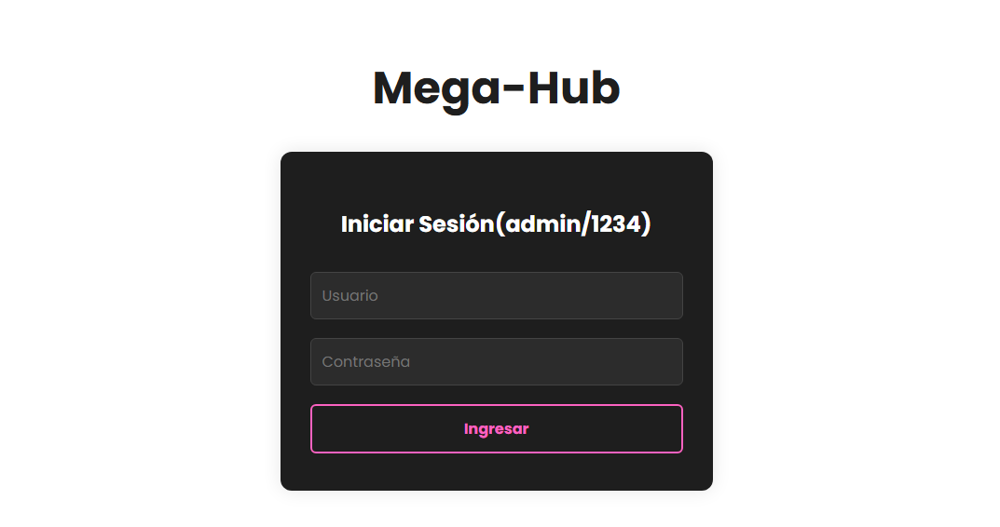

# 🎬 MegaHUB

Bienvenido a **MegaHUB**, el mejor proyecto de plataforma de entretenimiento 100% original (NO copia 😎).Pensada como una plataforma tipo streaming, donde podrás explorar contenido multimedia como **películas**, **series**, marcar favoritos y próximamente configurar tu perfil.

Durante el desarrollo se incorporan buenas prácticas (si todo sale bien 🙏), modularización del código, componentes reutilizables, y arquitectura escalable en Angular 18.

---

## 🚀 Sprint 3 - Pruebas y Code Coverage(QA)

En este sprint se llevaron a cabo varias implementaciones, la creacion de la vista de favoritos, se crearon diversos servicios, cambios usando los nuevos control flows añadidos en la v17(mejoras en performance). Ademas se añadieron pruebas y se cumplio con un objetivo personal del 80% de code coverage

## pruebas


## coverage


---


## 📝 Sprint Review

### 🎯 Objetivo del Sprint
   - Implementacion de funcionalidades asincronas en el proyecto
   - 50% de testing code coverage
   - Responsividad
   - Performance
   - RXJS
   - Testing 

### ✅ Alcance logrado
- +80% de code coverage general(Statements, Branches etc.).
- RXJS(servicios y observables para manejar estados y favoritos).  
- Responsividad y experiencia de usuario al cambiar el enfoque de (nav-bar).
- Mejora de performance con el uso de nos nuevos control flows(@for, @if). ademas de mejor claridad a la hora de leer codigo.

### 🚧 Obstáculos encontrados
- El no haber empezado con pruebas y desarrollo a la vez dificulto mucho el seguimiento y el cumplir con requerimientos y un codigo de calidad  
- Algunos detalles visuales aún deben ajustarse (responsive y consistencia de tarjetas)

### 🔜 Próximos pasos
- login con BD
- Implementacion de la BD 
- Mejorar diseño responsive y agregar animaciones  

---

## 🔍 ¿Qué vas a encontrar?

- 🟢 Login funcional con credenciales válidas (`admin` / `1234`)
- 🧭 Navegación fluida entre diferentes interfaces
- 🧩 Componentes reutilizables
- 🌐 Rutas dinámicas con parámetros
- 🧼 Y un código que *esperemos* no te sangre los ojos 😅

---

## 🧪 Cómo instalar y correr el proyecto

1. Clona el repositorio:
```
git clone https://github.com/tu-usuario/megahub.git
```
2. Ingresa a la carpeta del proyecto:
```
cd  MegaHub
```

3. Instala las dependencias:
```
npm install
```
4. Ejecuta el servidor de desarrollo:
```
ng serve
```
---

## 🔐 Credenciales de acceso

- **Usuario:** `admin`  
- **Contraseña:** `1234`

---

## 🌍 Navegación y funcionalidades principales

- 🧭 Navegación entre secciones: Películas, Series, Favoritos, Configuración(pendiente)
- 🧩 Componentes standalone y reutilizables
- 📂 Rutas dinámicas con lazy loading (`/detalle/:titulo`)
- 💾 Visualización de contenido desde JSON local (simulando consumo de API)
- 🎯 Composición modular de vistas

---

## 📸 Mockups y vistas del proyecto

> A continuación algunas capturas del proyecto en funcionamiento:

### 📱 Pantalla principal


### 🎞️ Vista de Películas


### 📄 Detalle de Contenido


### ⭐ Favoritos


---

## 📁 Contenido JSON simulado

Por ahora, el contenido de películas y series se carga desde un archivo `peliculas.json` ubicado en `src/assets/data/`.

Formato:
```
{
"titulo": "Un titulazo",
"ruta_imagen": "una-increible-imagen.jpg",
"descripcion": "Pedazo de descripción",
"tipo": "pelicula"
}
```

---

## ✅ Cosas que hice bien

✔️ Entendi un problema la arquitectura de la app, al tener un logica compartida entre home y nav-bar creaba acople y dependencia que generaba conflictos en otras paginas

✔️ Comprendi el poder de los observables para el compartir info/estados entre componentes de manera escalabe y en tiempo real

✔️ Identifique cuando es bueno un obsevable y cuando un simple Service es suficiente(caso de: nav-bar y favorites)

✔️ Añadir mas contenido y terminar algunas funcionalidades pendientes

---

## ⚠️ Cosas que podrían mejorar

❌ Algunos temas de css y diseño

❌ una interfaz con mas cosas, tal vez abuso un poco de el minimalismo

❌ Los alias siguen pendientes :c

❌ Tal vez preparar mi login para en un futuro implementar BD 

---

## 🧠 Aprendizajes clave

- Diferencia entre comunicacion con @Input @Output, Servicios y Observables(Para cuando las cosas se actualizan)
- Test y code coverage(en funciones, branches,lines etc.).
- @for, @if @else, @switch, que mejoran en performance, legibilidad y no te obligan a crear templates o cosas raras

---

## ⚙️ Tecnologías utilizadas

- Angular 18  
- TypeScript  
- HTML5 + SCSS  
- Node.js  
- JSON  

---
